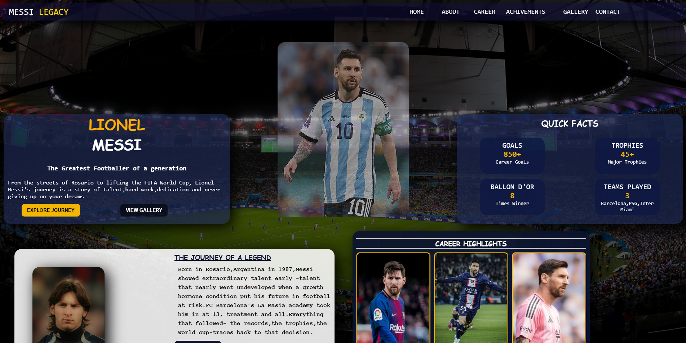
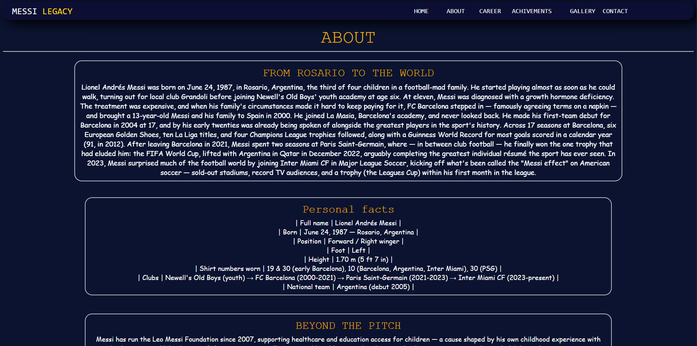
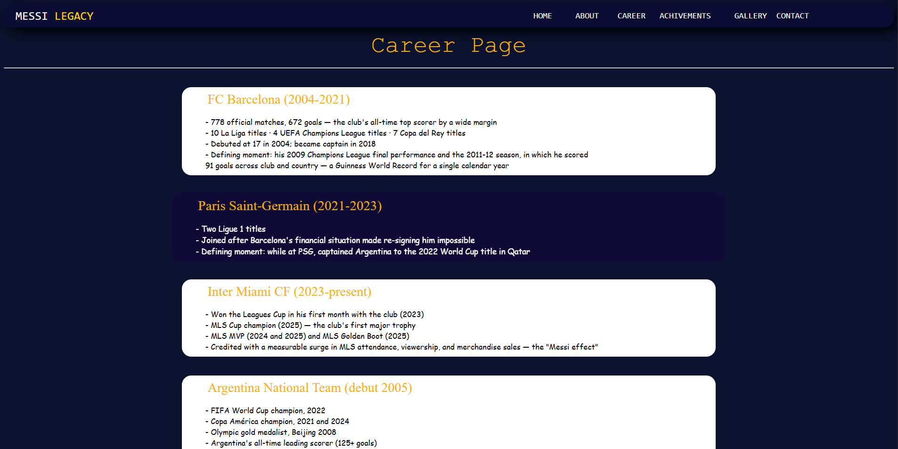
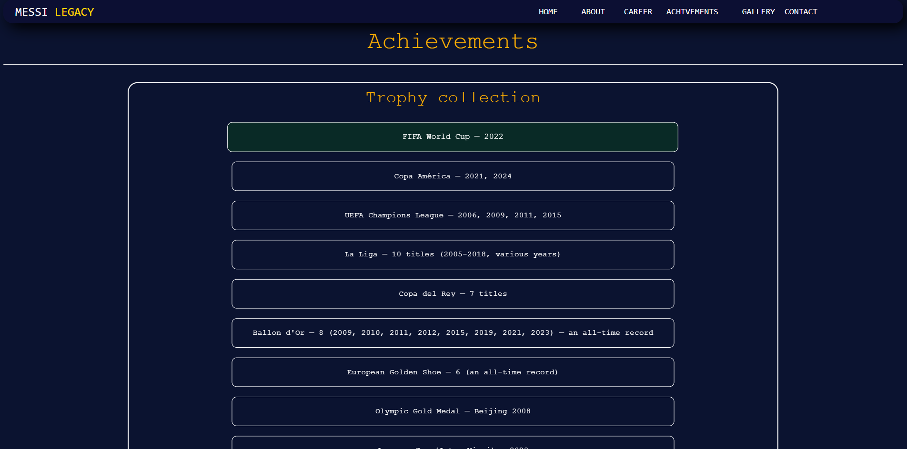
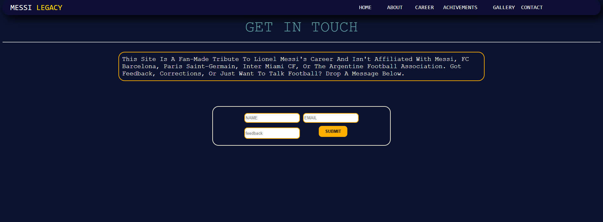

# Messi-Legacy

This is my one of my best project made with html and css from a 2 month experience.
It is a simple website called Messi-legacy. Its about LIONEL MESSI and his career.
It is a inspirational page for youngster who dreaming to be like him.His entire career in one web

## Live Demo

[Open the live website](YOUR-LIVE-LINK)

## Screenshots

## Features

- Almost all information about messi
- Animation in almost every card
- Maintained a theme
- feedback option(but fake)
- clean format

## Built With

- HTML
- CSS

## Installation to run locally

1. Clone this repository:

git clone YOUR-REPOSITORY-LINK

2. Open the project folder in VS Code.

3. Open `index.html` in your browser.

### How It Works

You can explore the messi's career through the webpage with a theme

## Design

I designed it with a theme of navy and gold,used white and navy in almost every cards and used courier,monospace as fonts

## Challenges

my main challange is that with images.one is big one is small but i manage it.

## What I Learned

- Lot of html,css concepts as a beginner
- learned to make the div and grids

## Credits

- Images and assets: copyright belong to the rightful owner
- Libraries: used claude for taking the information about Messi

## License

This project was created for Hack Club Macondo under MIT-do what ever with it.